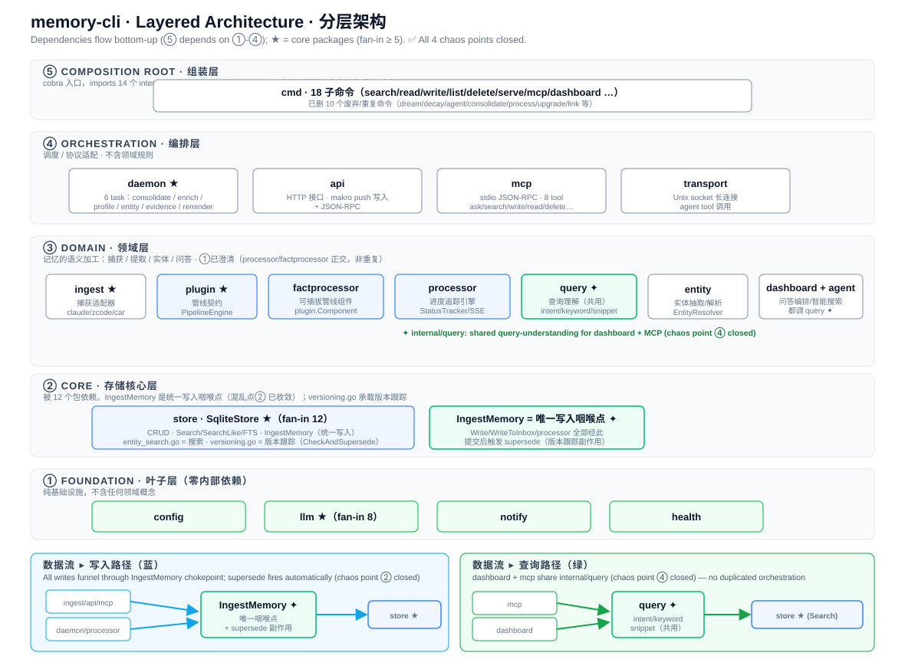

# memory-cli · Architecture & Layering · 架构与分层

> **EN** — Goal: every feature change lands in the **correct layer**; no more loss of control.
> This doc is the shared contract — before coding, ask "which layer is this?" first.
>
> **中** — 目的：让每个 feature 改动都能落到**正确的层**，避免再次失控。
> 本文是"共同契约"——动手前先问"这在第几层"，再写代码。



---

## Overview · 总览

**EN** — memory-cli is a **5-layer** architecture with **strict bottom-up** dependencies (higher layers depend on lower; lower layers never import higher). The dependency graph is a clean DAG with **no cycles**. The earlier "loss of control" feeling came not from structural decay but from **duplicate implementations** and **scattered entry points** inside layers ③④ — all four chaos points are now closed (see below).

**中** — memory-cli 是 **5 层**架构，依赖方向**严格自底向上**。依赖图是干净的 DAG，**无循环依赖**。失控感来自 ③④ 层内部的**重复实现**和**入口分散**——四个混乱点现已全部关闭。

Dependency direction: **① → ② → ③ → ④ → ⑤** (⑤ is the composition root, depends on everything).
依赖方向：**① → ② → ③ → ④ → ⑤**（⑤ 是组装层，依赖一切）。

---

## The Five Layers · 五层详解

### ① Foundation · 基础层（叶子，零内部依赖）

| Package · 包 | Responsibility · 职责 | Rule · 规则 |
|----|------|------|
| `config` | Config loading (`~/.memory/config.yaml`) · 配置加载 | **Imports no internal packages** · 不 import 任何 internal 包 |
| `llm` ★ | LLM client (GLM-4.5-Flash via z.ai) · LLM 客户端 | Pure protocol adapter · 纯协议适配 |
| `notify` | macOS notification push · macOS 通知推送 | Pure I/O |
| `health` | Health check · 健康检查 | Pure state |

**Rule · 规则**：These packages can **only be depended upon, never depend on others**. `llm` is depended on by 8 packages — the second most central after `store`.
这层包**只能被依赖，不能依赖别人**。`llm` 被 8 个包依赖，仅次于 store。

### ② Core · 存储核心层

| Package · 包 | Responsibility · 职责 | fan-in |
|----|------|--------|
| `store` ★ | SqliteStore · CRUD · search (FTS/SearchLike/SearchWithExpansion) · version marking | **12** |

**Rule · 规则**：`store` is the foundation, depended on by **12 packages**. It should only do **storage + retrieval** — no semantic judgment.
`store` 是地基，**12 个包依赖它**。只做**存储 + 检索**，不含语义判断。

**File organization · 文件组织**：`sqlite.go` (CRUD/search) · `entity_search.go` (search expansion) · `versioning.go` (version tracking: `CheckAndSupersede`/`IsSuperseded`/`MarkSuperseded`) · `metadata.go` (JSON merge).

### ③ Domain · 领域层（记忆的语义加工）

**EN** — The semantic-processing factory. Four pipelines:
**中** — 语义加工厂，四条流水线：

| Package · 包 | Responsibility · 职责 | Status |
|----|------|------|
| `ingest` ★ | Capture adapters (claude/zcode/car-agent/fingersaver JSONL → Memory) · 捕获适配器 | ✅ Stable · 稳 |
| `plugin` ★ | Pipeline contract (`Component` interface + `PipelineEngine`) · 管线契约 | ✅ Contract layer · 契约层 |
| `factprocessor` | Pluggable Extract+Merge component (via plugin contract) · 可插拔管线组件 | ✅ Active, orthogonal to processor · 与 processor 正交 |
| `processor` | SSE-tracked Extract+Merge engine (`StatusTracker`/`GlobalTracker`) · 进度追踪引擎 | ✅ Active, orthogonal to factprocessor · 与 factprocessor 正交 |
| `entity` | Entity extraction / `EntityResolver` / wiki-link parsing · 实体抽取 | ✅ Stable · 稳 |
| `query` ✦ | Query understanding (intent detection / keyword extraction / CJK split / snippet) — **shared by dashboard + MCP** · 查询理解（dashboard 与 MCP 共用） | ✅ New (chaos point ④) |
| `agent` | Smart search (`memory_smart_search`) + tool registration (transport depends on it) · 智能搜索 | ✅ Active, transport depends on it |
| `dashboard` | Ask orchestration (`ask_workflow` 7-stage pipeline) · 问答编排 | ✅ Active · 活 |

**Rules · 规则**：
- Capture (ingest) → process (factprocessor via plugin) → entity — the **write semantic chain** of memories.
  捕获 → 加工 → 实体，记忆的**写入语义链**。
- `processor` (SSE tracking) and `factprocessor` (pluggable contract) are **orthogonal, NOT duplicates** (chaos point ①). **Do not add a third Extract+Merge pipeline.**
  processor / factprocessor **正交，非重复**。**禁止新增第三条 Extract+Merge 管线。**

### ④ Orchestration · 编排层

| Package · 包 | Responsibility · 职责 |
|----|------|
| `daemon` ★ | Background task scheduling (6 tasks) · 后台任务调度 |
| `api` | HTTP + JSON-RPC (makro push-write entry) · HTTP 接口 |
| `mcp` | stdio JSON-RPC (Claude Code / zcode integration, 8 tools) · MCP 协议 |
| `transport` | Unix socket persistent connection (agent tool calls) · Unix socket |

**Rule · 规则**：Protocol adaptation + scheduling only — no domain rules. They write to `store` directly via the unified `IngestMemory` chokepoint.
协议适配 + 调度，不含领域规则。通过统一咽喉点 `IngestMemory` 写 store。

**daemon's 6 tasks · 6 个 task**：
| Task | Purpose · 作用 |
|------|------|
| `ConsolidateLLMTask` | processed → organized (LLM merge) |
| `EnrichTagsTask` | tag enrichment · tag 富化 |
| `ProfileTask` | user profile synthesis (→ character) · 画像合成 |
| `EntityExtractionTask` | LLM entity discovery (fills entity graph) · 实体抽取 |
| `EvidenceTask` | proposal accept/reject aggregation (→ evidence) · 拟合信号聚合 |
| `ReminderTask` | due reminders → macOS notifications · 到期提醒 |

### ⑤ Composition Root · 组装层

| Package · 包 | Responsibility · 职责 |
|----|------|
| `cmd` | 18 cobra subcommands, imports all internal packages for DI · 18 个 cobra 子命令 |

**Rule · 规则**：`cmd` does **only wiring** (assembly + arg parsing) — no domain logic.
`cmd` **只做组装 + 参数解析**，不含领域逻辑。

---

## Data Flow · 数据流

### Write path · 写入路径（unified chokepoint · 统一咽喉点）

```
ingest / api / mcp / daemon / processor
            │
            ▼
     IngestMemory ✦  ←── single chokepoint (唯一咽喉点)
            │  + supersede side-effect after commit (提交后触发版本跟踪副作用)
            ▼
        store ★
```

**EN** — All writes funnel through `IngestMemory`. Supersede (version tracking) fires as a post-commit side-effect, so every write path triggers it — not just one caller that remembered (chaos point ②, closed).
**中** — 所有写入经 `IngestMemory` 单一咽喉点。supersede 是提交后副作用，所有写入路径自动触发（混乱点② 已收敛）。

### Query path · 查询路径

```
mcp / dashboard ─→ query ✦ ─→ SearchWithExpansion ─→ store ★
                  (intent/keyword/snippet — shared · 共用)
```

**EN** — Both dashboard and MCP call the same `internal/query` package, so the same question gets the same answer regardless of entry point (chaos point ④, closed).
**中** — dashboard 和 MCP 共用 `internal/query`，同一问题同一答案，不再因入口不同而分叉（混乱点④ 已收敛）。

---

## Chaos Points (all closed · 混乱点，全部关闭)

These were the sources of "loss of control". All four are now closed — annotated and converged/retracted one by one.

这些是"失控感"的来源。四个混乱点现已全部关闭。

### ① ~~Three Extract+Merge implementations~~ → ✅ Clarified: processor/factprocessor are orthogonal, not duplicates · 澄清：正交非重复

`processor` (SSE-tracked engine) and `factprocessor` (pluggable contract component) are **orthogonal dimensions**, not duplicates. No convergence needed — coexistence is by design.
processor（进度追踪）与 factprocessor（可插拔契约）**正交**，非重复。并存是设计意图，不作收敛。

### ② ~~Scattered write entry points (17)~~ → ✅ Converged · 已收敛

`IngestMemory` is now the single write chokepoint; `Write`/`WriteToInbox`/`processor` all route through it. Supersede is a post-commit side-effect firing on every path. Regression test: `TestWritePathsTriggerSupersede`.
`IngestMemory` 统一咽喉点，supersede 提交后自动触发，所有写入路径覆盖。

### ③ ~~Version tracking misplaced~~ → ✅ Retracted (premise was wrong) · 作废（依据错）

Original claim "needs entity+predicate the store lacks" was FALSE — the judgment uses only content/category/project/phase/timestamps (text-overlap heuristic). Versioning stays in store; logic extracted to `versioning.go` for honest organization. Pure refactor, zero behavior change.
原主张错（纯文本相似度，不用 entity/predicate）。版本跟踪留在 store，仅抽到 `versioning.go` 做职责整理。

### ④ ~~MCP duplicated dashboard ask orchestration~~ → ✅ Converged · 已收敛

`runAskWorkflowMCP` + 4 `*Standalone` helpers deleted. New `internal/query` package holds the single canonical query-understanding logic. MCP time-intent upgraded from 今天/昨天 to 近N天/上周/这周/前天/月日/日期范围. Net -274 lines.
MCP 删除重复编排，新建 `internal/query` 公共包，dashboard 与 MCP 共用。

---

## Cross-Layer Rules · 跨层规则（改 feature 前对照）

These rules are the "ruler". Before each change ask: **which layer? violating dependency direction? reinventing?**
这些规则是"尺子"。每次改动问：**这逻辑在哪层？违反依赖方向？重复造？**

1. **Dependencies only downward · 依赖只能向下**：Higher depends on lower; lower never imports higher. `store` must not import `daemon`/`dashboard`.
2. **No semantic judgment in store · 语义判断不上浮到 store**：store only does CRUD + retrieval. "Is this the same fact" / "should this supersede" / "is this a user preference" belong in ③ or are passed by the caller.
3. **Clear pipeline responsibilities · 管线职责清晰**：Two coexisting Extract+Merge implementations is **design intent, not debt** — `processor` (SSE tracking) / `factprocessor` (pluggable contract) are orthogonal. **Do not add a third.**
4. **cmd only assembles · cmd 只组装不加工**：Domain logic (extract/merge/orchestration) sinks to ③④; cmd only parses args + calls.
5. **Search behavior unified · 搜索行为统一**：dashboard and MCP call the same query pipeline, no separate copies.

---

## Decision Flow for Adding/Modifying/Removing a Feature · 改 feature 的决策流程

1. **Locate the layer · 定位层**：Which of ①-⑤? (storage? domain semantics? protocol? assembly?)
2. **Check for duplication · 查重复**：Does ③ already have a similar implementation? (especially Extract+Merge, query orchestration)
3. **Verify dependencies · 验依赖**：Does the change introduce an upward dependency? (store → domain is forbidden)
4. **Check the entry point · 看入口**：If writing, will it become a new scattered entry? Route through `IngestMemory`.
5. **Against the rules · 对规则**：Any of the 5 cross-layer rules violated?

Only proceed once all pass. **That's how changes stay controllable.**
满足后再动手。**这样改动才可控。**

---

## Appendix: Dependency Graph (fan-in) · 附：依赖关系

| Package · 包 | fan-in (dependents) | Role · 角色 |
|----|---------|------|
| `store` ★ | 12 | Storage core · 存储核心 |
| `llm` ★ | 8 | LLM core · LLM 核心 |
| `config` | 5 | Config · 配置 |
| `plugin` | 5 | Pipeline contract · 管线契约 |
| `ingest`/`processor`/`entity` | 3 | domain |
| `agent`/`daemon`/`notify` | 2 | domain/orchestration |
| others | 1 | edge / composition |

> Source: grep of all non-test `.go` imports, verified 2026-06-27. No cycles (DAG confirmed).
> 数据来源：grep 所有非测试 `.go` import，2026-06-27 校验。无循环依赖。

---

## Ops Quick Reference · 运维速查（symptom → where to fix · 症状 → 改哪）

| Symptom · 症状 | Fix here · 改这里 | Layer · 层 |
|------|--------|------|
| Data source ingestion broken · 数据源抓取错 | `ingest/<source>.go` | ③ |
| Extracted facts inaccurate · 提炼事实不准 | `factprocessor.go`/`processor.go` extract | ③ |
| Ask time-intent misdetected · 时间识别错 | `query/intent.go` → `DetectTimeIntent` | ③ |
| Ask keywords poor (noise) · 关键词差 | `query/intent.go` → `LLMExtractKeywords` | ③ |
| Chinese search misses · 中文搜不到 | `store/sqlite.go` → `SearchLike` | ② |
| Version tracking wrong/silent · 版本跟踪错 | `store/versioning.go` → `CheckAndSupersede` | ② |
| Write fails · 写入失败 | `store/sqlite.go` → `IngestMemory` | ② |
| daemon task not running · task 不跑 | `cmd/serve.go` → `AddTask` | ④/⑤ |
| LLM errors/timeout · LLM 抽风 | `llm/` (model/prompt/timeout) | ① |

**Extension points · 扩展点**：
- New data source · 新数据源 → `ingest/` adapter + `plugin` register
- New daemon task · 新后台任务 → `daemon/` Task impl + `serve.go` AddTask
- New MCP tool · 新 MCP 工具 → `mcp/server.go` definition + handler
